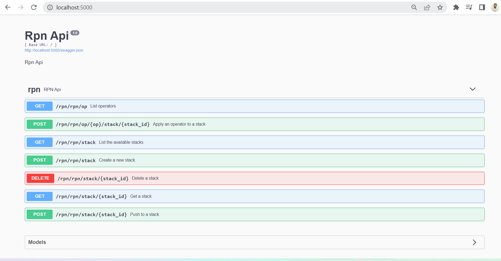

## Getting Started

**Step 1. Clone the code into a fresh folder**

```
$ git clone https://github.com/mlahmadix/RPN_FLASK
$ cd RPN_FLASK
```

**Step 2. Create a Virtual Environment and install Dependencies.**

Create a new Virtual Environment for the project and activate it.

```
$ python -m venv venv
$ source venv/bin/activate
```

Then, you need to install the project dependencies, which are listed in `requirements.txt`.

```
(venv) $ pip install -r requirements.txt
```

**Step3. Run the application**

```
(venv) $ flask run
```

Open http://localhost:5000 to view it in your browser.

**Swagger**:



